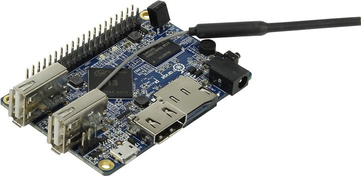
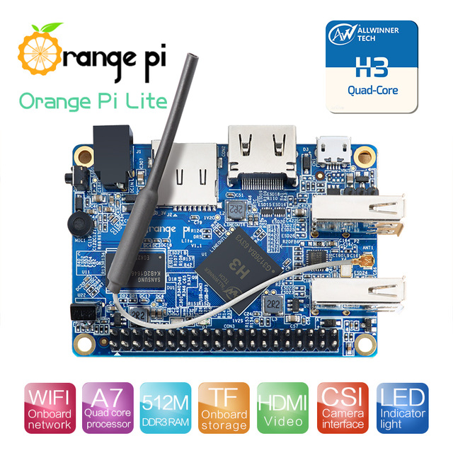
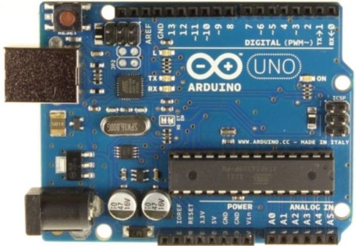
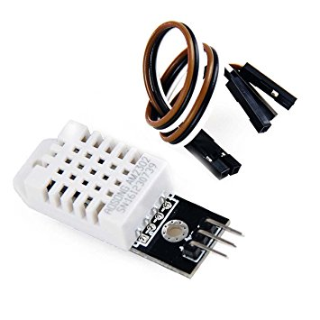
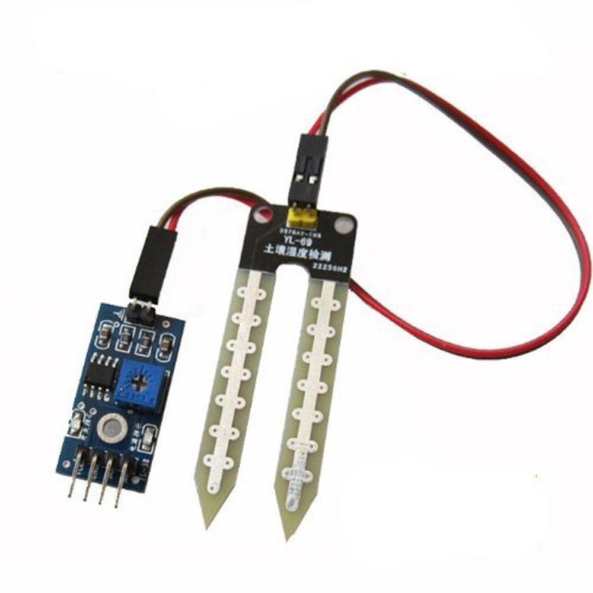

# graduate-project
</h1> graduate-project </h1>
<h2>Device:<h2>
<h3> 1.OrangePI Lite </h3>
 
 
<h3> 2.Arduino UNO R3</h3>
 
<h3> 3.Sensor</h3>

<h4> 3.1. DHT22(Tempature and Humidity)</h4>
 
<h4> 3.2. Soil Moisture Sensor</h4>
 